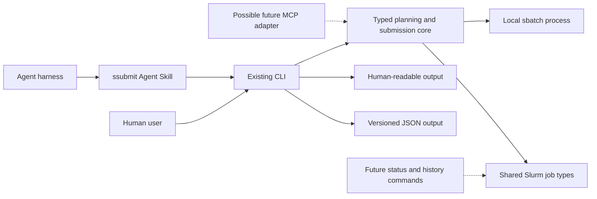

# Agent-friendly job submission

Status: accepted design

Date: 2026-08-04

Implementation tracker: [GitHub issue #11](https://github.com/mbhall88/ssubmit/issues/11)

GitHub issue #11 and its implementation tickets are the source of truth for current status and acceptance criteria. This document records the design decisions and staged plan that produced that specification.

## Outcome

Make `ssubmit` straightforward and reliable for an LLM agent running locally on a Slurm login node, without making the integration specific to one agent harness.

The first release will provide:

- the existing CLI arguments as the input interface;
- a versioned JSON output contract for batch planning and submission;
- reliable exit codes and structured Slurm errors;
- a portable Agent Skill, versioned in this repository;
- one-command installation through the `skills` CLI, with a manual fallback.

It will not provide remote submission, job monitoring, job cancellation, persistent cluster profiles, new first-class Slurm resource flags, or an MCP server.

## Product decisions

- Agents run on the cluster and invoke local `ssubmit` and `sbatch` executables.
- Existing invocations remain valid and retain their current text output unless correcting an error condition.
- `--dry-run --json` plans a batch job without submitting it.
- `--json` submits a batch job and returns its Slurm job identifier.
- Machine mode does not support `--interactive`.
- Arbitrary `sbatch` arguments remain available after `--`.
- The existing implicit `--export=ALL` behaviour remains unchanged. Its credential implications are documented rather than repeatedly logged.
- The skill may activate automatically and may also be invoked explicitly where a harness supports that behaviour.
- MCP remains a possible adapter if demand appears after the CLI contract is in use.
- Monitoring and completed-job inspection remain a later product phase, but the core types introduced here should not obstruct them.

## Proposed architecture



The important boundary is the typed Rust core. CLI parsing, text rendering, JSON rendering and process execution should not remain mixed in `src/main.rs`. Both the existing human interface and any future adapter should use the same planning and submission functions.

## Versioned JSON contract

Add an additive `--json` flag. Do not add `plan` or `submit` subcommands in this phase.

Every machine response should be one JSON object on stdout and contain:

- `schema_version`, initially `1`;
- `operation`, such as `plan`, `test` or `submit`;
- `ok`;
- the normalised job specification;
- the effective `sbatch` executable and argument array;
- the rendered submission script when a plan was produced;
- a submission result or structured error, as applicable.

An indicative planning response is:

```json
{
  "schema_version": 1,
  "operation": "plan",
  "ok": true,
  "plan": {
    "job": {
      "name": "align",
      "command": "minimap2 ref.fa reads.fq > out.paf",
      "memory": "16000M",
      "time": "2:0:0",
      "output": "%x.out",
      "error": "%x.err",
      "export": "ALL"
    },
    "slurm": {
      "executable": "sbatch",
      "arguments": [
        "--cpus-per-task=8",
        "--export=ALL"
      ],
      "script": "#!/usr/bin/env bash\n..."
    }
  }
}
```

An indicative successful submission result is:

```json
{
  "schema_version": 1,
  "operation": "submit",
  "ok": true,
  "submission": {
    "job_id": "123456",
    "cluster": null
  }
}
```

`job_id` should be a string, not an integer, so the contract can represent Slurm identifiers that are not simple numbers.

An indicative failure is:

```json
{
  "schema_version": 1,
  "operation": "submit",
  "ok": false,
  "error": {
    "kind": "slurm",
    "message": "sbatch rejected the job",
    "exit_code": 1,
    "stderr": "sbatch: error: Invalid partition name"
  }
}
```

The implementation may refine field names before release, but the final schema must be reviewed and fixed by contract tests. JSON errors should still use a non-zero process exit status. Human-mode parsing errors should retain normal Clap presentation.

Commit a JSON Schema at `schemas/ssubmit-output-v1.schema.json`. Treat additive fields as compatible. Removing fields, changing their types, or changing their meaning requires a new schema version. A runtime schema-discovery command is not required in this phase.

## Reliable Slurm submission

For JSON submissions, invoke `sbatch --parsable` and parse the documented `job_id[;cluster]` response. Preserve the identifier as text. Errors remain on stderr at the process boundary and are represented in the JSON error object.

Machine mode must reject or resolve passthrough options that break the contract, particularly options such as `--quiet` that suppress the job identifier. User-supplied `--parsable` should be de-duplicated rather than rejected. Other arbitrary Slurm options remain visible in the effective argument array.

Correct the current error behaviour in all modes. A non-zero `sbatch` result must propagate as a non-zero `ssubmit` exit status. This is an intentional correctness fix even though a script could theoretically have depended on the old false-success behaviour.

The Slurm behaviour is documented in the official [`sbatch` reference](https://slurm.schedmd.com/sbatch.html).

## Rust implementation shape

Introduce typed structures in the library layer. Exact names can change during implementation, but the responsibilities should resemble:

- `JobSpec` for normalised user intent;
- `SubmissionPlan` for the effective `sbatch` arguments and generated script;
- `SubmissionResult` for job ID and optional cluster;
- `SubmissionError` for validation, process, Slurm and output-parsing failures;
- a small process-execution boundary that can be replaced with a fake in tests.

Move these behaviours out of `src/main.rs`:

1. normalising CLI values;
2. constructing effective Slurm arguments;
3. building a batch plan;
4. executing `sbatch`;
5. parsing submission results;
6. rendering text or JSON.

Keep `make_submission_script` as one implementation detail behind planning rather than making adapters reconstruct scripts independently.

While touching CLI environment handling, correct the `SSUUBMIT_TIME` typo. If compatibility with the misspelled variable is retained, support it temporarily as a deprecated alias while documenting `SSUBMIT_TIME` as canonical.

## Agent Skill

Add one skill at `skills/ssubmit/SKILL.md`, following the open [Agent Skills specification](https://agentskills.io/specification).

Its discovery description should cover Slurm batch submission, resource planning, `ssubmit`, `sbatch`, dry runs and scheduler tests. The compatibility field should state that the skill requires:

- the `ssubmit` release containing JSON mode;
- local `sbatch` access;
- execution on a Slurm login or submission node.

The skill should instruct an agent to:

1. confirm that `ssubmit` and `sbatch` are available;
2. preserve the user's command, paths and requested resources;
3. never invent a site-specific partition, account or QoS;
4. use `--dry-run --json` when it inferred important parameters;
5. show the relevant plan and obtain approval when authority is unclear;
6. submit directly when the user supplied the material parameters and clearly requested execution;
7. parse the JSON result rather than scrape logs;
8. report the job ID and output/error filename patterns;
9. explain that the default `--export=ALL` can pass tokens or API keys from the agent environment, and show how to use `--export NONE` or a named variable list;
10. use `--test-only --json` when scheduler validation is useful.

Include concise examples for CPUs, partitions, GPUs, accounts and QoS using the existing passthrough syntax. Do not duplicate the full `sbatch` manual or add an experimental `allowed-tools` declaration.

## Skill distribution

Make the repository discoverable by the open `skills` CLI. The intended installation experience is:

```shell
npx skills@latest add mbhall88/ssubmit --skill ssubmit --agent '*' --global --yes
```

Document an explicit update command and a manual Git/copy fallback for clusters without Node.js or outbound network access. Verify the final command against the released repository rather than assuming discovery works from the proposed layout.

The installer supports many harnesses and anonymous telemetry-backed directory rankings. Treat any displayed install count as a coarse adoption signal, not a count of active users or actual job submissions. Do not add independent telemetry to `ssubmit`. See the official [`skills` CLI documentation](https://www.skills.sh/docs/cli).

## Documentation

Update the README with:

- an agent-use section showing plan and submit examples;
- the stable stdout, stderr and exit-code rules;
- the supported JSON schema version;
- skill installation, update and manual fallback instructions;
- the `--export=ALL` warning;
- the local-cluster and batch-only boundaries;
- a clear statement that installing the skill does not install `ssubmit` itself.

Generated full CLI help currently appears more than once in the README and is already stale in places. Update or generate it as part of this work so the new flag is documented from one authoritative source.

## Verification

CI must not require access to a Slurm cluster.

Add unit and integration coverage for:

- text-mode backward compatibility;
- JSON dry runs never executing `sbatch`;
- successful parsable responses with and without a cluster name;
- job identifiers represented as strings;
- invalid or empty success output;
- `sbatch` non-zero exits and stderr capture;
- process termination by signal;
- rejection of `--interactive --json`;
- passthrough argument ordering and visibility;
- `--quiet` and `--parsable` conflict handling;
- `--test-only --json`;
- stdout containing exactly one valid JSON object in machine mode;
- non-zero exit status for every failure class;
- representative outputs validating against the committed JSON Schema;
- skill validation with the reference validator;
- repository discovery with `npx skills ... --list`.

Use a fake `sbatch` executable or injected process runner for CI integration tests. Do not rely only on unit tests that reproduce the production argument-building logic.

Before release, run a manual cluster smoke test covering:

1. JSON dry run;
2. scheduler test-only mode;
3. a trivial successful batch job;
4. a deliberately invalid partition;
5. job ID and optional cluster parsing;
6. unchanged human-readable invocation.

The current baseline is 65 passing Rust tests across the library and binary targets.

## Delivery phases

### Phase 1 Core contract

- Refactor planning and execution behind typed library interfaces.
- Fix Slurm failure exit codes.
- Add `--json` and reject interactive machine mode.
- Add parsable submission handling.
- Commit and validate schema version 1.
- Preserve existing text-mode invocations.

Release this as the first independently useful milestone.

### Phase 2 Agent packaging

- Add and validate the `ssubmit` Agent Skill.
- Add README guidance and installation commands.
- Test discovery and updates through the `skills` CLI.
- Run the manual Slurm smoke test.
- Release the CLI and matching skill together.

### Phase 3 Monitoring discovery

After the submission contract has real use, research a human-friendly view over `squeue` and `sacct` that normalises site-specific formatting. Start by defining common job identity, state, resources, timestamps, exit status and failure-reason types. Do not commit to command names or a project rename until that workflow has been grilled separately.

### Optional adapter

Only if users demonstrate that their harness cannot call local executables reliably, add an MCP adapter over the typed core. It should not spawn an LLM, manage SSH, or duplicate Slurm parsing. MCP tools can then expose schema-defined plan and submit operations using the same domain objects. The protocol's tool schema and consent model are documented in the [MCP tools specification](https://modelcontextprotocol.io/specification/2025-06-18/server/tools).

## Completion criteria

The agent milestone is complete when:

- every existing supported human invocation still works;
- an agent can plan and submit a batch job using only `ssubmit --help`, the installed skill and local executables;
- every machine-mode result is schema-valid and unambiguous;
- a rejected Slurm submission cannot be mistaken for success;
- the returned job ID does not depend on scraping human log text;
- the skill installs through one `npx skills` command and has a documented non-Node fallback;
- no remote execution, monitoring or MCP code has leaked into the milestone.
